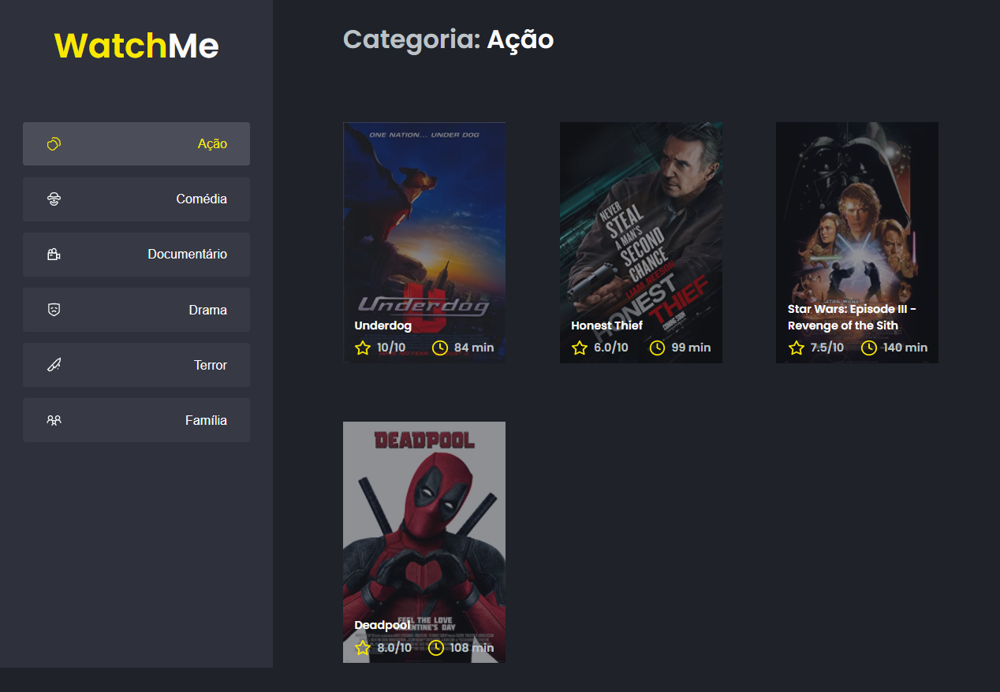

<div align="center" id="top"> 
  

  &#xa0;

  <!-- <a href="https://whatchme.netlify.com">Demo</a> -->
</div>

<h1 align="center">Whatch Me</h1>

<p align="center">
  

  

  

  

  <!--  -->

  <!--  -->

  <!--  -->
</p>

<!-- Status -->

<!-- <h4 align="center"> 
	🚧  Whatch Me 🚀 Em construção...  🚧
</h4> 

<hr> -->

<p align="center">
  <a href="#dart-sobre">Sobre</a> &#xa0; | &#xa0; 
  <a href="#sparkles-funcionalidades">Funcionalidades</a> &#xa0; | &#xa0;
  <a href="#rocket-tecnologias">Tecnologias</a> &#xa0; | &#xa0;
  <a href="#white_check_mark-pré-requesitos">Pré requisitos</a> &#xa0; | &#xa0;
  <a href="#checkered_flag-começando">Começando</a> &#xa0; | &#xa0;
  <a href="#memo-licença">Licença</a> &#xa0; | &#xa0;
  <a href="https://github.com/thiagonmiziara" target="_blank">Autor</a>
</p>

<br>

## :dart: Sobre ##

Sobre o seu projeto

## :sparkles: Funcionalidades ##

:heavy_check_mark: Consumir um fake API feita com Json Server
:heavy_check_mark: Lista de Filmes
:heavy_check_mark: GET

## :rocket: Tecnologias ##

As seguintes ferramentas foram usadas na construção do projeto:


- [React](https://pt-br.reactjs.org/)
- [TypeScript](https://www.typescriptlang.org/)
- [Sass](https://pt-br.sass.org/)
- [Json Server](https://pt-br.jsonServer.org/)


## :white_check_mark: Pré requisitos ##

Antes de começar :checkered_flag:, você precisa ter o [Git](https://git-scm.com) e o [Node](https://nodejs.org/en/) instalados em sua maquina.

## :checkered_flag: Começando ##

```bash
# Clone este repositório
$ git clone https://github.com/thiagonmiziara/whatch-me

# Entre na pasta
$ cd whatch-me

# Instale as dependências
$ yarn

# Para iniciar fake API Json Server
$ yarn server

# Para iniciar o projeto
$ yarn dev para front-ende

# O app vai inicializar em <http://localhost:3000>
```

## :memo: Licença ##

Este projeto está sob licença MIT. Veja o arquivo [LICENSE](LICENSE.md) para mais detalhes.


Feito com :heart: por <a href="https://github.com/thiagonmiziara" target="_blank">thiagonmiziara</a>

&#xa0;

<a href="#top">Voltar para o topo</a>
